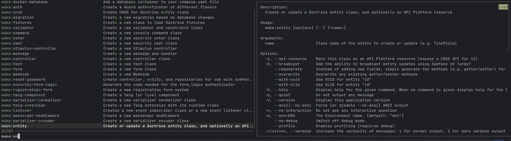

# Some bash scripting which I am using

## Symfony autocomplete with FZF 
I couldn't find fzf implementation for symfony console, therefore here you go: 



```
cmd=$(bin/console list --raw | fzf --bind "enter:become(echo {1})" --preview "bin/console {1} --help") && read -p "Params: " params && bin/console $cmd $params
```

It supports additional parameters.

Add it as alias:

```
alias binc='cmd=$(bin/console list --raw | fzf --bind "enter:become(echo {1})" --preview "bin/console {1} --help") && read -p "Params: " params && bin/console $cmd $params'
```

